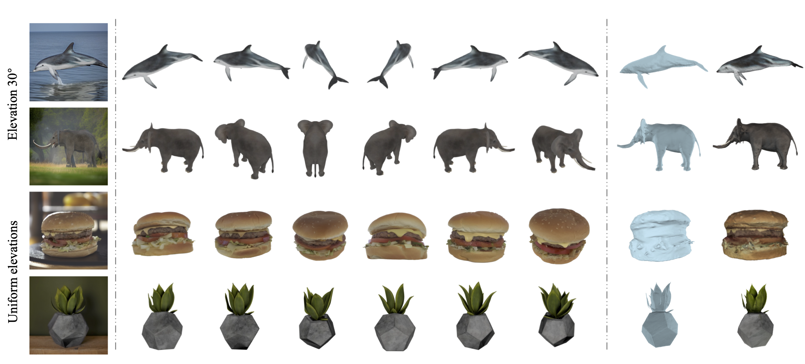
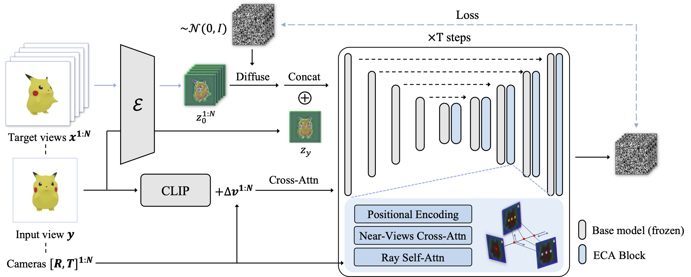

# EpiDiff

[CVPR 2024] EpiDiff: Enhancing Multi-View Synthesis via Localized Epipolar-Constrained Diffusion

> 🔥 We have released the training code and model checkpoint of our baseline. We will gradually release the complete code and model.

## 🏠 <a href="https://huanngzh.github.io/EpiDiff/" target="_blank">Project Page</a> | <a href="https://arxiv.org/abs/2312.06725" target="_blank">Paper</a>



Abstract: _We propose EpiDiff, a localized interactive multiview diffusion model. At the core of the proposed approach is to insert a lightweight epipolar attention block into the frozen diffusion model, leveraging epipolar constraints to enable cross-view interaction among feature maps of neighboring views. The newly initialized 3D modeling module preserves the original feature distribution of the diffusion model, exhibiting compatibility with a variety of base diffusion models._

## 🔨 Method Overview



## 🔥 Updates

- 2024-04-02: Training code, inference code and model checkpoint of our baseline EpiDiff are released. The model is trained on 16 fixed views and aggregates F=16 views to target view.

## 🔧 Installation

Just one command to prepare training and test environments:
```Bash
pip install -r requirements.txt
```

## Preparation for training

Check our dataset examples [here](https://huggingface.co/huanngzh/EpiDiff/tree/main/train_data_examples). We uniformly render 96 views with a size of 256×256. The layout comprises 6 concentric circles, each as a layer, with elevation angles set at {−10, 0, 10, 20, 30, 40}. Each circle contains 16 cameras spaced evenly from 0 to 360 in azimuth angle.

```Bash
|-- 00
|   `-- 000a3d9fa4ff4c888e71e698694eb0b0 # object id
|       |-- render_0000.webp
|       |-- ...
|       `-- meta.json # meta info
|-- caption_test.txt
|-- caption_train.txt
`-- caption_val.txt
```

You can use [huanngzh/render-toolbox](https://github.com/huanngzh/render-toolbox) to render 3D scenes and may get the same format like our dataset examples.

## Training

After preparing the data, you need to modify the config file `configs/baseline.yaml` to meet your needs. Pay special attention to modifying the path in the data set configuration, like `root_dir` and `caption_path`.

To train on one node, please use:
```Bash
torchrun --nnodes=1 --nproc_per_node=8 train.py --config /path/to/your-config.yaml
```

To train on multiple machines and multiple cards in a distributed environment, you may use the command like:
```Bash
torchrun \
--nnodes=$WORLD_SIZE \
--node_rank=$RANK \
--master_addr=$HOSTNAME \
--nproc_per_node=8 \
--master_port=$MASTER_PORT \
train.py --config /path/to/your-config.yaml
```

During training, you will see the validation results in both `output_dir` and logger (if you desire `wandb` like the baseline config).

## Inference

Please download our pretrained model checkpoint from [Huggingface](https://huggingface.co/huanngzh/EpiDiff). Then run the following command to inference:

```Bash
python inference.py \
--config configs/baseline.yaml \
--ckpt /path/to/checkpoint \
--input_img testset/3D_Dollhouse_Lamp.webp \
--output_dir outputs \
--elevation 30 \
--seed 0 \
--device cuda
```

## 🤝 Acknowledgement

We appreciate the open source of the following projects:

[Zero123](https://github.com/cvlab-columbia/zero123) &#8194;
[One-2-3-45](https://github.com/One-2-3-45/One-2-3-45) &#8194;
[SyncDreamer](https://github.com/liuyuan-pal/SyncDreamer) &#8194;
[threestudio](https://github.com/threestudio-project/threestudio) &#8194;
[instant-nsr-pl](https://github.com/bennyguo/instant-nsr-pl) &#8194;
[Stable Diffusion](https://github.com/CompVis/stable-diffusion) &#8194;
[diffusers](https://github.com/huggingface/diffusers) &#8194;
[MVDiffusion](https://github.com/Tangshitao/MVDiffusion) &#8194;
[GPNR](https://github.com/google-research/google-research/tree/master/gen_patch_neural_rendering)

We also appreciate the strong tools [pytorch lightning](https://github.com/Lightning-AI/pytorch-lightning) and [hydra](https://github.com/facebookresearch/hydra), which helps build a good training framework.

## 📎 Citation

If you find this repository useful, please consider citing:

```
@article{huang2023epidiff,
  title={EpiDiff: Enhancing Multi-View Synthesis via Localized Epipolar-Constrained Diffusion},
  author={Huang, Zehuan and Wen, Hao and Dong, Junting and Wang, Yaohui and Li, Yangguang and Chen, Xinyuan and Cao, Yan-Pei and Liang, Ding and Qiao, Yu and Dai, Bo and others},
  journal={arXiv preprint arXiv:2312.06725},
  year={2023}
}
```

